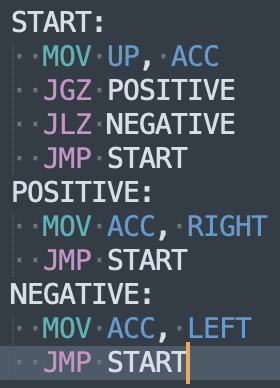

## TIS-100 Assembly Sublime Syntax

[TIS-100](http://www.zachtronics.com/tis-100/) is one of my favorite games, in which you must debug a broken mainframe in a specific assembler language.

I wanted to be able to scratch out some ideas in Sublime so I created this syntax highlighter to make it a bit easier. Fun stuff.

#### Example:

